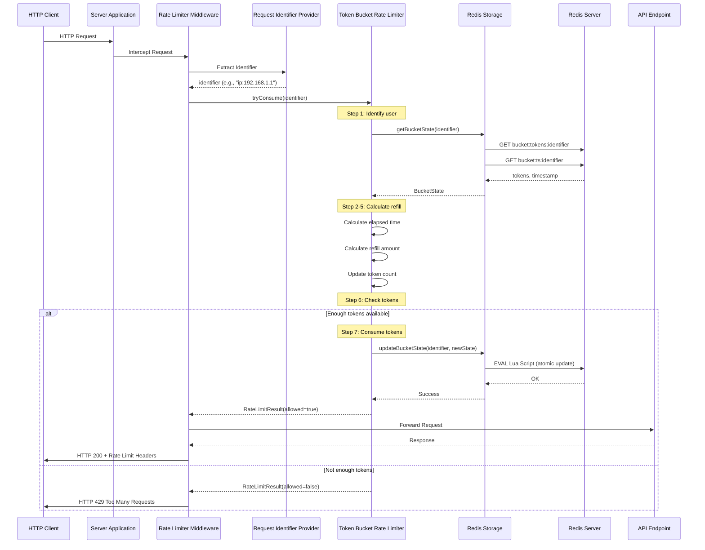

# RateLimiter_SystemDesign




## Overview

A distributed **token bucket** rate limiter. Each identifier (API key, user id, or IP)
gets a bucket that refills at a fixed rate up to a maximum capacity; a request is
allowed only if it can consume the required tokens.

The refill → check → consume step runs **atomically** in the storage backend, so the
limit holds even under high concurrency and across multiple server instances sharing
one Redis. (With Redis this is a single Lua script; the in-memory backend uses an
atomic `ConcurrentHashMap.compute`.)

## Storage backends

| `storage.type` | Description | Use when |
| -------------- | ----------- | -------- |
| `redis`        | Shared state in Redis, atomic Lua script, keys auto-expire via TTL | Production / multiple instances |
| `memory`       | In-process `ConcurrentHashMap`, no external dependency | Local dev, demos, tests |

## Configuration

Set in `src/main/resources/application.properties` (defaults shown):

```properties
rate.limiter.capacity=10                 # max tokens in the bucket
rate.limiter.refill.rate.per.second=2.0  # tokens added per second
rate.limiter.tokens.required=1           # tokens consumed per request
storage.type=redis                       # redis | memory
redis.host=localhost
redis.port=6379
server.port=8080
```

## Running

```bash
# Server mode (HTTP endpoints behind the limiter)
mvn -q compile exec:java -Dexec.args="--serverside"

# Client mode (interactive rate-limited HTTP client)
mvn -q compile exec:java -Dexec.args="--clientside --userId=user123 --apiKey=key456"
```

Server endpoints: `GET /api/hello`, `GET /api/data`, `POST /api/echo`, `GET /api/health`.
Allowed responses include `X-RateLimit-Remaining` / `X-RateLimit-Capacity` headers;
throttled requests return `429 Too Many Requests`.

## Testing

```bash
mvn test
```

Includes `concurrentRequestsNeverExceedCapacity`, which hammers a single bucket from
50 threads and asserts that **exactly** `capacity` requests are allowed — the guarantee
the limiter exists to provide.
